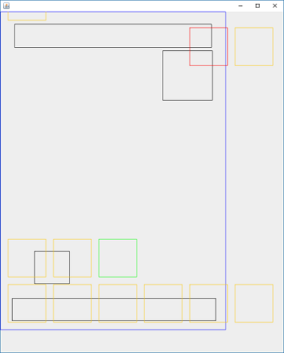

# pdf-signature-position
Obtains a new visible signature position in a PDF that ensures no overlapping with existing ones.

Originally developed to avoid visible signature overlapping when using **@firma MiniApplet** repeatedly on the same document.

## Generation
It's a usual Maven project:
~~~
mvn clean package
~~~

## Use
The artifact it's a Java 5 Library. The invocation it's as simple as creating an instance and calling *getNextPosition* with an *InputStream* to the PDF document and the desired position.
~~~
PdfSignaturePosition psp = new PdfSignaturePosition();
SignaturePosition nextPosition = psp.getNextPosition(fis, position);
~~~
If *null* position is informed it will use defaults in properties:
~~~
signature.pdf.position.default.page=1

signature.pdf.position.default.lowerLeftX=40
signature.pdf.position.default.lowerLeftY=100
signature.pdf.position.default.upperRightX=130
signature.pdf.position.default.upperRightY=200

signature.pdf.position.default.margin=10
~~~

### Signature position
The origin of coordinates is the lower left corner of the document.

The signature rectangle is informed by two points coordinates:
* Lower left corner
* Upper right corner

### Positioning algorithm
The positioning algorithm is simple:
1. Check for overlapping or out of margins with current position.
2. Until no overlapping or out of margins repeat update position:
  i. If collision move right.
  ii. If out of right margin move one line up.
  iii. If out of top margin move to bottom line.

To avoid infinite loops the process is limited to 50 iterations and rises a *RuntimeException* if reached.

## Log
Log is managed by Simple Logging Facade for Java (SLF4J).

## Extension
The positioning algorithm can be redefined overriding *updatePosition* method.
~~~
protected void updatePosition(Rectangle signatureRectangle, Rectangle collision, boolean outInRight, boolean outInTop, float margin)
~~~

## Visual representation
To ease tracing calculated positions in development, the library creates a visual representation when launched with system property *signature.pdf.position.visual* (constant provided):
~~~
System.setProperty(Simulator.SYSTEM_PROPERTY_ENABLE_VISUAL, "");
~~~
After the process ends it launchs a window showing:

where color boxes are:
* Blue - Document
* Black - Current visible signatures in document
* Red - Initial position
* Orange - Intermediate position
* Green - Final position returned
